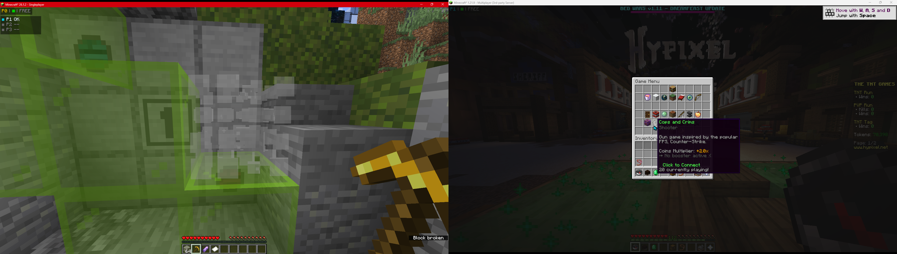
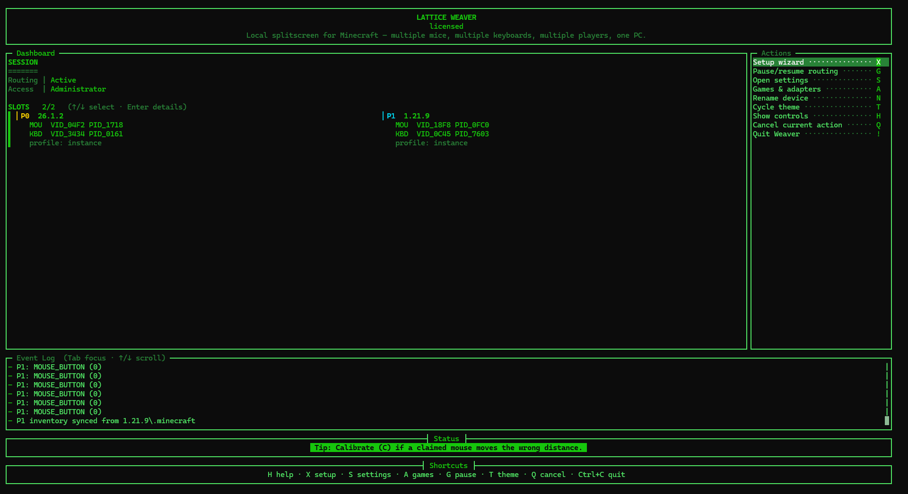
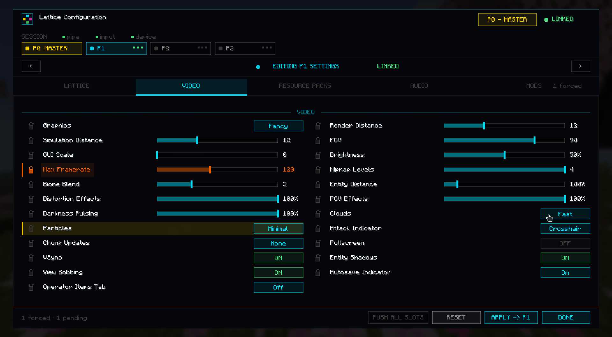
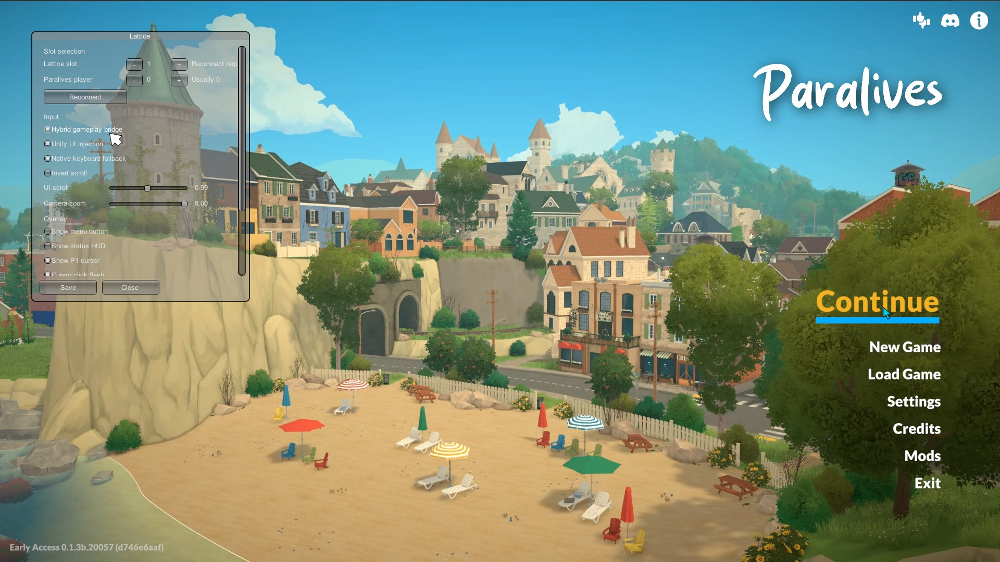
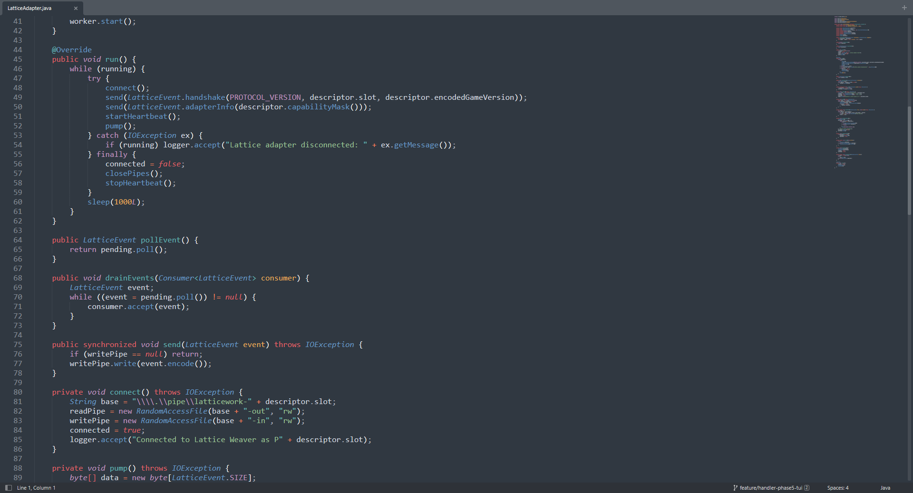

# Lattice

### Local couch co-op for Windows games

Give extra local players their own keyboard, mouse, cursor, and game window on one PC.

---

  

## What Lattice Does

Lattice is a Windows companion app plus game-side adapters for local multi-player setups that normally need multiple PCs.

- Player 0 keeps native Windows control.
- Additional players use selected keyboards and mice assigned through Lattice Weaver.
- Supported game windows receive the right player's input through their adapter.
- Each player can have an independent cursor, settings profile, and slot status.
- Setup is handled through Weaver's guided device flow.

## Supported Games

| Game | Status | Notes |
| --- | --- | --- |
| Minecraft Java | Supported | Fabric builds for Minecraft `1.20` through `26.1.2`. |
| Paralives | Supported | Plugin adapter for routed second-player mouse and keyboard input. |
| Developer adapters | Public devkit | SDKs, schemas, and sample manifests for adapter developers. |

Experimental adapters are not listed here until they are release-ready.

## Lattice Weaver

  

Weaver is the Windows companion app. It handles player slots, guided setup, device assignment, profile selection, and game-adapter connections.

Download Weaver and current game files from:

**https://files.bide.cx/**

## Minecraft

  

The Minecraft adapter adds the in-game side of Lattice:

- Per-slot HUD and virtual cursor.
- P0 master controls for routed player instances.
- Audio, video, resource-pack, profile, and selected mod-config controls.
- Lockable settings for routed players where supported.
- MultiMC-style JVM setup support through Weaver.

Minecraft users can also install through Modrinth:

**https://modrinth.com/mod/latticework**

## Paralives

  

The Paralives adapter routes an additional player's mouse and keyboard into the game while Player 0 remains native.

## Developer Devkit

  

The public devkit includes adapter schemas, sample manifests, Java and C# SDK surfaces, and adapter contract notes.

Weaver remains closed-source. The devkit exposes only the public adapter surface for supported-game integrations.

Download the devkit from:

**https://files.bide.cx/Lattice-Devkit.zip**

## Links

| Destination | Link |
| --- | --- |
| Downloads | https://files.bide.cx/ |
| Latest GitHub release | https://github.com/bideco/lattice-weaver/releases/latest |
| Minecraft mod | https://modrinth.com/mod/latticework |
| License purchase | https://buy.polar.sh/polar_cl_qnTeBhgJpeI7j7WgCHctmznEsHK9W5wrLsQaV33itbu |
| Support | support@bide.cx |
| Orders | orders@bide.cx |

---

### bideco

solo maker · Windows tooling · game adapters

